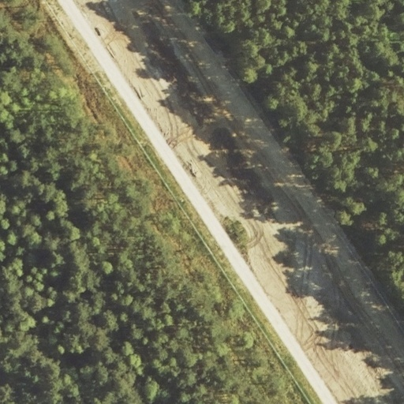
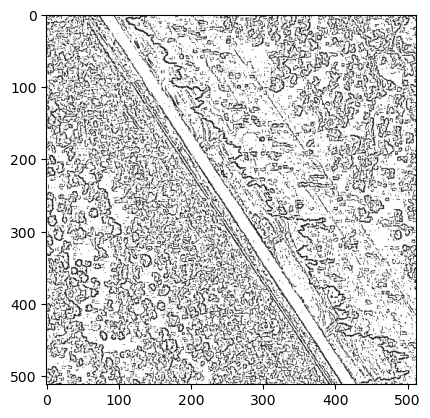
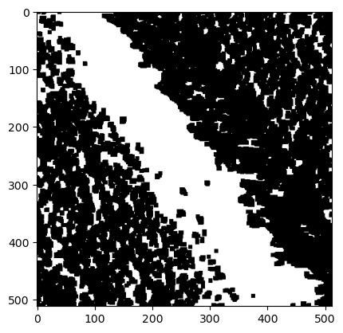

# Edge Detection 

In addition to segmentation of aerial images, we also considered applying edge detection to images to produce a training set for our Siamese Network. Edge detection is a term for methods that aim to identify edges, curves and boundaries in a digital image. Our thinking was that by using edge detection we could highlight features such as roads in images. Edge detection also the advantage over deep learning methods such as segmentation that it is computationally inexpensive and quick to run. 

We tried a few different edge detection techniques - an open source method designed for satellite images (https://github.com/Josh-Abraham/EECS4422-SatelliteImagePreprocessing), and morphological transformations available in the CV2 python package. Some results are shown below.

# Weighting results during Mapping Stage

An idea we had to improve the selection of the location of the drone was to weigh the possibilities according to the last known location of the drone. This would increase the probability of areas near the drones last known location being picked, and help avoid errors that send the suggested location far across the map to a location that the drone could not reasonably have reached in a given time. To implement this, during the selection stage, we transformed the distance matrix by applying a Gaussian blur with centre at the last known location.

Testing on this method was hampered by our models overall performance, but with a better model this method could potentially be applied to improve results. 
