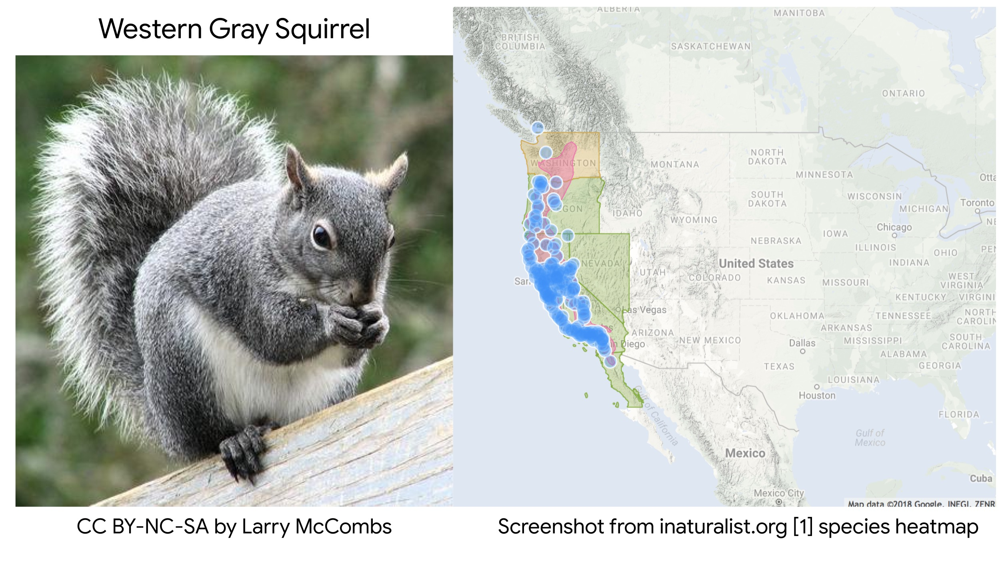
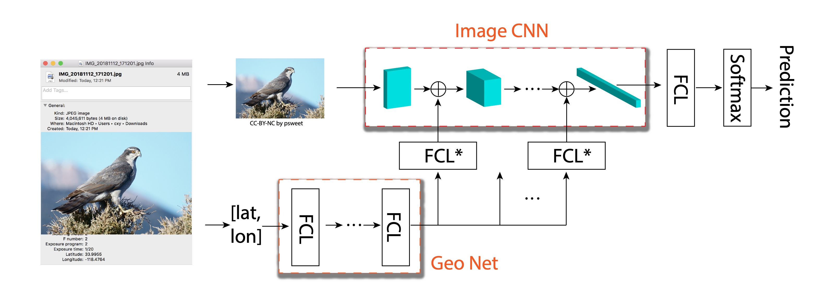
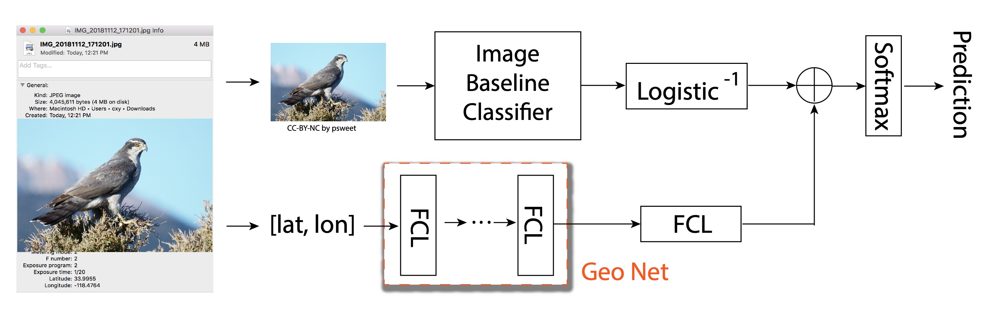

# Context Injection

Context Injection is a machine learning technique in which otherwise discarded ancillary data is used to increase model performance. Dstl has studied, reported and deployed context injection and may be able to provide support. 

For this application, we recommend applying context injection by concatenating a vector containing relevant sensor readings with the siamese network's feature vector. A couple fully connected layers can be added after this concatenation and the model trained from there. Other architectures and training reigimes have been studied such as concatenating with an intermediate convolutional layer or freezing cnn weights in final training. All images are taken from the following paper, which is a good resource to get started with context injection.

[Chu, Grace, et al. "Geo-aware networks for fine-grained recognition." Proceedings of the IEEE/CVF International Conference on Computer Vision Workshops. 2019.](https://arxiv.org/pdf/1906.01737.pdf)

## Is this an eastern or western gray squirrel? 
Answering this question is very difficult unless you are a subject matter expert, there a slight physical differences unknown to most people. However, when given a population heatmap for each species and a geo reference of the image, it is easy to make an educated guess. This is the broad concept of context injection.

## Example architecture concatenating context vector with convolutional layers:

## Example architecture concatenating context vector with baseline model's feature vector: 

