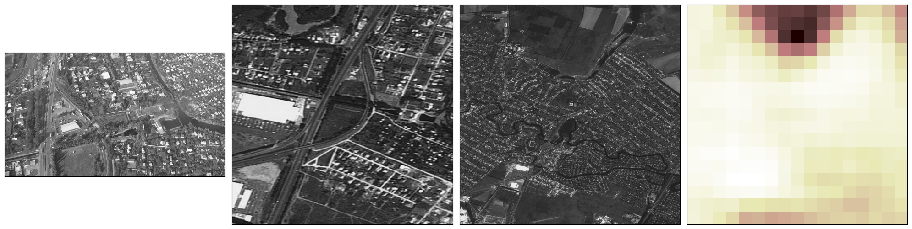

# **Mapping**

## **Georeferencing the drones footage into a predicted location on a map.**

The drone footage contains key information about where the drone is located through features such as buildings, roads and field boundaries.
This can be referenced back to a map in order to find where these features are, a process the human brain does naturally when looking at the imagery.

To do this a Siamese network is used which calculates the similarity between a still from the drone footage and a patch of the map image. This network uses a ResNet18 backbone that has been pretrained on earth observation tasks using satellite images, from: [github](https://github.com/zhu-xlab/SSL4EO-S12), [paper](https://arxiv.org/abs/2211.07044). This trained backbone has model weights that have already learnt how to extract useful features from remote sensing images which reduces the model training needed and increases the generalisation potential of the model to new tasks. ResNet18 is used over any deeper models due to bearing in mind the necessity of this running on a drone so minimal model parameters are ideal. The first and last layers of the model are customised to suit out task and the images presented to the model. The network outputs an embedding that represents the features in the images and this is used to calculate the similarity between images through calculating the Euclidean distance. 

The model is then trained on the [LandCover.ai](https://landcover.ai.linuxpolska.com/) dataset to learn to predict the similarity metrics through taking a triplet of image patches from a large orthophoto - the anchor as the unmodified patch, the positive image of the same patch transformed, and a negative of a random patch from elsewhere in the image. The triplet loss function is then used to train the model, teaching it that embeddings between the positive and anchor should be close and between the negative and the anchor should be further apart. This is an unsupervised training method, none of the drone footage is used during training in order to prevent data leakage and assess the generalisation potential of the model.

During inference the map image is sliced into overlapping patches and the one most similar to the drone footage still is predicted. The location of the centre pixel of this patch is then located and returned. The patch size used can make a significant difference to the results and may need to be calculated based off drone altitude and camera zoom. This is then changed into a longitude and latitude through the maps information.



__Example of the model's predictions:__ From left to right: Drone image acting as input to the model, The predicted patch of the map outputted from model, the satellite image used as a map for the geolocation, heatmap of model's predicted similarity over the map, white as more similar. 

____

## **Requirements**
    pytorch torchvision torchgeo cv2 tqdm

____

## **Swapping models and Feature Extraction Methods**


The code has been designed with the intention to make swapping out models easy. A class is passed to the geolocation code that has ```__call__``` implemented so that when called on a drone image patch and a map image patch the model/feature extraction is called and the embeddings returned. This should allow easy modifcation during any further work in order to change the model without having to change any of the functions.

This workflow has also been tried with a no feature extraction, calculating a distance purely in pixel space, edge detection algorithms and multiple different trained models.

___
## **Siamese Network Training**

Training methods tried:
> - Triplet loss, margin 1 and 10 tried.
> - Significant data augmentation - randomised perspective, crop, scale, flipping, rotation and brightness/contrast variations.
> - Additional data - Additional satellite images grabbed from regions around Ukraine from maptiller in order to supplement training, these are handled in the same way as the landcover.ai dataset.

Hyperparameters for demonstrated model:
>  - Margin = 1
>  - Learning Rate = 1e-4
>  - Number of epochs = 100

### **How to train the model**

Training code is provided in train_siamese.py. When run this file will train the model, alternatively the training loop is in a function that can be imported.

Set training arguments as follows:
> - DATA_FOLDER: set as folder containing images
> - MARGIN: margin for loss function during training, used 1 for model given
> - LR: learning rate during training, used 1e-4
> - NUM_EPOCHS: number of epochs to train for
> - SAVE_PATH: path to save trained models and checkpoints to

The model architecture used is the LandSiamese network defined in landcoversiamese.py file. It's a ResNet19 based model with swapped out first and last layers in order to suit this task.

### **Data used**

The training data is the [LandCover.ai](https://landcover.ai.linuxpolska.com/) datasets orthophotos. These are large satellite image patches. During training a random patch is selected from these and assigned as the anchor. The same patch is then transformed and deformed to make the positive patch image. The negative patch image is picked from an another random patch in the image and also deformed. These three images then make one training example. The model is taught to push the embeddings of the positive image and the anchor closer together whilst moving the negative image and the anchor further apart through the [triplet loss](https://gombru.github.io/2019/04/03/ranking_loss/), [torch implentation](https://pytorch.org/docs/stable/generated/torch.nn.TripletMarginLoss.html).

This could be easily added to for custom data of that same format as these images, additional large files from satellite images can be added to the data containing folder.


#### **Training with custom data**

Training with data of a different format, such as drone and corresponding satellite images will require a different [torch dataset](https://pytorch.org/tutorials/beginner/data_loading_tutorial.html). The model expects single channel greyscale images. The rest of the training code and the model architecture should work as written after this.
This should significantly improve performance as the current domain gap between training and inference is significant for the model to overcome.

Pseudocode:
```python
class DroneSatData(torch.utils.data.Dataset):
    def __init__(self, training_dir):
        pass
    
    def __len__(self):
        return len(training_set)

    def __getitem__(self, idx):
        timestamp, location = data[idx]
        anchor = sat_image_patch_corresponding_to_drone_location
        positive = image_from_drone_footage_at_that_moment
        negative = image_from_drone_footage_at_another_moment
        
        return anchor, positive, negative
```
