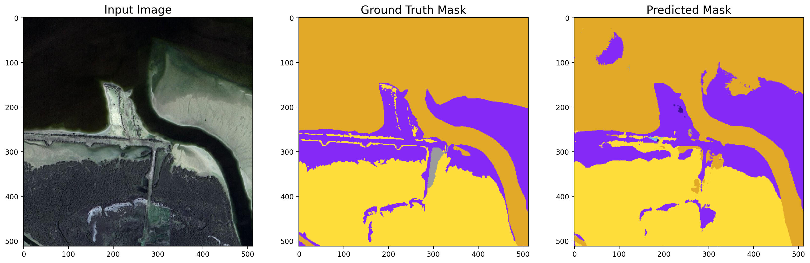

# Segmentation

The idea: Take image from UAV camera and split into regions (e.g road, buildings, vegetation, water) that can feed into Siamese network to match with an area on map. 

We searched for open source models to perform segmentation, and implemented a solution that used transfer learning on an InceptionResNetV2 encoder based UNet CNN model, trained on satellite images (top down camera images of landscapes, similar to top down footage from drone cameras). 
https://github.com/ayushdabra/dubai-satellite-imagery-segmentation 

We also looked at focusing on segmenting roads from the images, as these would by very useful for helping a UAV to locate and navigate. I looked through a number of open source implementations and focused on one called RoadNet. RoadNet is a CNN that is trained to simultaneously predict road surfaces, edges, and centerlines It’s results were better than the previous attempt at segmentation for roads, but still patchy. 
https://github.com/yhlleo/DeepSegmentor

The results from open source models on the challenge data were ok, but we felt they were not accurate enough to generate a useful training set. Strange artefacts were found in a lot of images in both approaches, probably due to the challenge data being too different from the data the model was trained on. Because of this we decided to fine tune a segmentation model on a dataset with more representative data. We chose the landcover.ai dataset – a dataset for segmentation of aerial images that were collected in Poland. We fine tuned ResNet on this data to produce a model that segmented small sections of aerial images into four classes – buildings, land, water and roads. We then tested this model on some of the data provided by the challenge organisers. The results were an improvement on the open source models. 