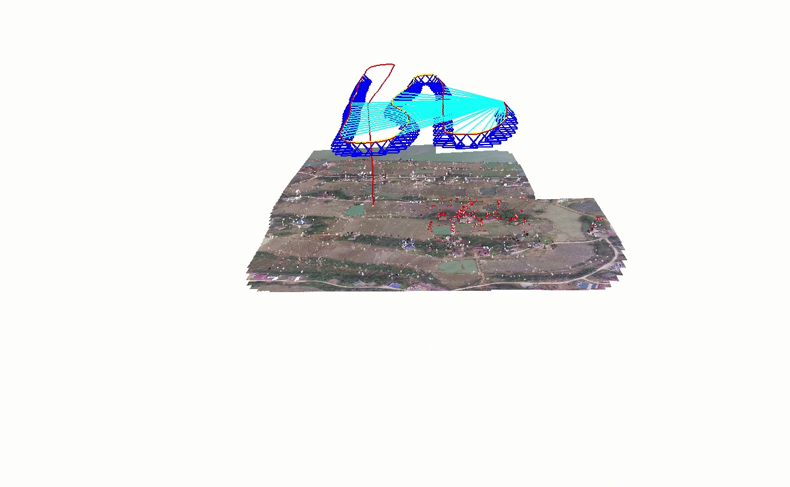

# Visual Inertial Odometry and Simultaneous Localisation and Mapping

Useful techniques to be aware of are VIO and SLAM. 

## VIO

Visual Inertial Odometry is the process of using the video feed and Inertial Measurement Unit (IMU) data to predict the location of a platform. This would be the default method of continued localisation after GPS is jammed/spoofed. The issue with this technique is that errors will compound exponentially over time. This is because each prediction assumes the previous location to be correct, and any subsequent predictions will be relative to that point.

The most promising library we found to do VIO is https://github.com/rpng/open_vins. 

## SLAM

Simultaneous Localisation and Mapping (SLAM) is the term used to refer to this common problem in robotics. Specifically we are dealing with a monocular From our research we conclude that these techniques will have low performance in the outdoor drone task as the algorithms expect dense features to register points against, such as doors, windows and furniture in an indoor scene.

[Map2DFusion](https://github.com/zdzhaoyong/Map2DFusion) 

